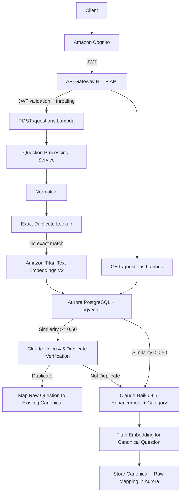

# Interview AI

An AWS-based interview question processing API that deduplicates raw interview questions, maps them to canonical questions, enhances new questions with an LLM, and classifies them by interview category.

## What It Does

Given raw questions such as:

- `self intro`
- `introduce yourself`
- `tell me something about yourself`

the system attempts to determine whether they represent the same underlying interview question.

If a duplicate is found, the new raw wording is mapped to an existing canonical question.

If the question is new, the system:

1. Standardizes it into a canonical question.
2. Expands it into a clearer interview-ready version.
3. Assigns an interview category.
4. Generates an embedding.
5. Stores both the canonical question and the raw-to-canonical mapping.

## Architecture



## Tech Stack

### Application
- Node.js
- TypeScript
- AWS Lambda
- esbuild

### AI
- Amazon Bedrock
- Amazon Titan Text Embeddings V2
- Claude Haiku 4.5

### Database
- Aurora PostgreSQL
- pgvector
- IAM database authentication

### API and Security
- Amazon API Gateway HTTP API
- Amazon Cognito
- JWT authorization
- API Gateway throttling
- TLS
- IAM least-privilege roles

### Infrastructure
- Terraform
- AWS CLI
- CloudWatch

## API

### POST `/questions`

Processes one raw interview question.

Example request:

```json
{
  "question": "What is a race condition?"
}
```

Example response for a new question:

```json
{
  "duplicate": false,
  "matchType": null,
  "similarityScore": null,
  "canonicalQuestion": {
    "canonicalQuestion": "What is a race condition?",
    "enhancedQuestion": "Can you explain what a race condition is, including when it occurs and why it is problematic in concurrent systems?",
    "category": "TECHNICAL"
  }
}
```

Possible match types:

- `EXACT`
- `SEMANTIC`
- `null` for a new canonical question

### GET `/questions`

Returns stored raw-to-canonical question mappings.

Both routes require a valid Cognito JWT.

## Deduplication Strategy

The system uses a multi-stage approach to reduce unnecessary LLM calls while avoiding false-positive semantic merges.

### Stage 1 — Normalization

Input is normalized by:

- trimming whitespace
- converting to lowercase
- removing punctuation
- collapsing repeated spaces

Example:

```text
"   INTRODUCE Yourself!!!   "
```

becomes:

```text
"introduce yourself"
```

### Stage 2 — Exact Duplicate Lookup

The normalized question is searched in `raw_questions`.

If it already exists, the system returns immediately:

```text
duplicate = true
matchType = EXACT
similarityScore = 1
```

This avoids unnecessary embedding and LLM calls.

### Stage 3 — Vector Candidate Retrieval

For questions without an exact match:

1. Titan Text Embeddings V2 creates a 1024-dimensional embedding.
2. pgvector searches the stored canonical embeddings using cosine distance.
3. The nearest canonical question is returned.
4. A similarity threshold of `0.50` determines whether the candidate is close enough for further verification.

### Stage 4 — LLM Duplicate Verification

Vector similarity alone can incorrectly merge questions with similar wording but different meaning.

Example:

```text
"What are your greatest strengths?"
"What are your greatest weaknesses?"
```

Titan similarity in the evaluation set:

```text
0.648
```

That is above the 0.50 threshold even though the questions should remain separate.

For candidates above the threshold, Claude Haiku performs a second-stage verification and answers whether both questions ask the same underlying question.

This allows the embedding model to act as a cheap candidate filter while using the LLM only for ambiguous cases.

### Stage 5 — New Question Creation

If no duplicate is confirmed:

1. Claude produces:
   - `canonicalQuestion`
   - `enhancedQuestion`
   - `category`
2. Titan embeds the short canonical question.
3. The canonical question is stored.
4. The original raw question is mapped to it.

## Database Design

### `canonical_questions`

One row represents one unique interview-question meaning.

| Column | Purpose |
|---|---|
| `id` | UUID primary key |
| `canonical_question` | Short standardized question |
| `enhanced_question` | Clearer interview-ready version |
| `category` | Interview category |
| `embedding` | `VECTOR(1024)` used for semantic search |
| `created_at` | Creation timestamp |

### `raw_questions`

Stores each raw wording and its mapping.

| Column | Purpose |
|---|---|
| `id` | UUID primary key |
| `raw_question` | Original submitted text |
| `normalized_question` | Normalized text used for exact dedup |
| `canonical_question_id` | Foreign key to canonical question |
| `similarity_score` | Semantic similarity when applicable |
| `created_at` | Creation timestamp |

Relationship:

```text
Many raw_questions
        ↓
One canonical_question
```

## Categories

Claude assigns exactly one category:

- `BEHAVIORAL`
- `CODING`
- `SYSTEM_DESIGN`
- `TECHNICAL`
- `LEADERSHIP`
- `PROJECT_EXPERIENCE`
- `COMPANY_CULTURE`
- `OTHER`

## Evaluation

A labeled evaluation set containing 8 duplicate pairs and 8 non-duplicate pairs was used.

### Titan-only result at threshold 0.50

```text
True Positives:  8
False Positives: 1
True Negatives:  7
False Negatives: 0

Precision: 0.889
Recall:    1.000
F1:        0.941
```

The false positive was:

```text
"What are your greatest strengths?"
"What are your greatest weaknesses?"
```

### Titan + Claude verification

```text
True Positives:  8
False Positives: 0
True Negatives:  8
False Negatives: 0

Precision: 1.000
Recall:    1.000
F1:        1.000
```

These results apply only to the small labeled evaluation set. A larger and more diverse dataset would be required to estimate production accuracy.

## Why a 0.50 Similarity Threshold?

Thresholds tested:

| Threshold | Precision | Recall | F1 |
|---:|---:|---:|---:|
| 0.40 | 0.889 | 1.000 | 0.941 |
| 0.45 | 0.889 | 1.000 | 0.941 |
| 0.50 | 0.889 | 1.000 | 0.941 |
| 0.55 | 0.857 | 0.750 | 0.800 |
| 0.60 | 0.833 | 0.625 | 0.714 |

Increasing the threshold reduced recall while still failing to eliminate the strengths-versus-weaknesses false positive.

Therefore, `0.50` is used as a candidate-retrieval threshold and Claude performs the final semantic decision for candidates above that threshold.

## Model Selection and Cost Strategy

### Titan Text Embeddings V2

Titan is used because semantic similarity is fundamentally an embedding/vector-search problem.

It provides:

- low-cost embedding generation
- 1024-dimensional vectors
- Bedrock integration
- compatibility with pgvector cosine similarity

### Claude Haiku 4.5

Haiku is used for:

- duplicate verification
- canonical question generation
- enhanced question generation
- category classification

The tasks are structured and relatively small. Haiku successfully handled the project's evaluation cases, so a larger and more expensive model was not necessary.

### Cost Optimization

The processing order intentionally minimizes paid AI calls:

```text
Normalize
   ↓
Exact DB lookup
   ↓ only if needed
Titan embedding
   ↓ only if similarity >= 0.50
Claude duplicate verification
   ↓ only if genuinely new
Claude enhancement
```

Obvious exact duplicates therefore require no Bedrock call, and obvious semantic non-matches do not require duplicate-verification calls to Claude.

## Security

### No AWS Keys in Code or Terraform

Local development uses AWS CLI temporary authentication.

Lambda receives temporary AWS credentials automatically through its execution role.

No AWS access key or secret access key is stored in the repository.

### No Database Password

Aurora Express uses IAM database authentication.

The application connects as:

```text
interview_app
```

and generates short-lived authentication tokens with `@aws-sdk/rds-signer`.

There is no production database password in source code, environment files, or Terraform.

### Least-Privilege Database User

`interview_app` is allowed to:

- connect to `interview_ai`
- use the `public` schema
- `SELECT`
- `INSERT`

It is not the PostgreSQL administrator.

### Lambda IAM

The Lambda execution role can:

- write CloudWatch logs
- invoke Bedrock
- connect to Aurora specifically as `interview_app`

### API Authentication

Amazon Cognito issues JWTs.

API Gateway validates the JWT before invoking Lambda.

Without a valid token:

```text
API Gateway → 401 Unauthorized
```

### Rate Limiting

API Gateway is configured with:

```text
Rate:  5 requests / second
Burst: 10 requests
```

This protects the API and limits unexpected Bedrock usage.

### TLS

Database traffic is encrypted with TLS and Lambda is configured to verify the Amazon RDS certificate chain.

## Infrastructure as Code

Terraform manages:

- Lambda functions
- Lambda IAM role and policies
- API Gateway HTTP API
- API routes and integrations
- Cognito user pool
- Cognito app client
- JWT authorizer
- API throttling
- Lambda permissions
- application packaging

### Aurora Express Note

The AWS account used for this project is on the AWS Free plan, which requires Aurora Express Configuration.

At the time of implementation, the native Terraform AWS provider did not expose the required `WithExpressConfiguration` flag. The Terraform configuration therefore uses `terraform_data` with `local-exec` to invoke the official AWS CLI `create-db-cluster --with-express-configuration` command.

A destroy provisioner also removes the Express-created database resources to keep cleanup reproducible.

## Local Development

Local PostgreSQL runs through Docker using:

```text
pgvector/pgvector:pg16
```

Local development uses a normal password stored in `.env`.

`.env` is excluded from Git.

The production deployment uses Aurora IAM authentication instead.

## Useful Commands

### Local development

```bash
npm run dev
```

### Build TypeScript

```bash
npm run build
```

### Build Lambda bundles

```bash
npm run build:lambda
```

### Run dedup evaluation

```bash
npm run evaluate:dedup
```

### Terraform

```bash
cd terraform

terraform init
terraform fmt
terraform validate
terraform plan
terraform apply
```

## Main Design Decisions

### Why Aurora PostgreSQL + pgvector instead of OpenSearch?

The application needs both:

- relational raw-to-canonical mappings
- vector similarity search

Aurora PostgreSQL with pgvector handles both in one datastore, which keeps the architecture simpler for this workload.

### Why embed the canonical question instead of the enhanced question?

The enhanced question may introduce extra explanatory language.

For example:

```text
Canonical:
"Tell me about yourself"

Enhanced:
"Tell me about yourself and walk me through your past experience."
```

Embedding the shorter canonical meaning produced better similarity behavior during testing.

### Why not use only an LLM for deduplication?

Calling an LLM for every stored question comparison would be more expensive and slower.

Embeddings + pgvector provide efficient candidate retrieval, while Claude is reserved for ambiguous candidates.

## Current Limitations

- The evaluation dataset is intentionally small.
- Only the nearest vector candidate is currently evaluated.
- No approximate vector index has been added because the dataset is currently small.
- Bedrock `InvokeModel` IAM access can be narrowed further to specific model and inference-profile ARNs.
- The project currently exposes only question creation and question-list endpoints.
- Production-scale observability and alerting could be expanded.

## Future Improvements

- Larger labeled dedup evaluation dataset
- pgvector HNSW index for larger datasets
- pagination for `GET /questions`
- request schema validation
- API Gateway access logging
- structured application logging
- CloudWatch alarms
- model/token usage telemetry
- automated integration tests
- CI/CD pipeline
- narrower Bedrock IAM resource permissions

## Summary

Interview AI demonstrates a cost-aware, two-stage semantic deduplication architecture using AWS-managed services.

The key idea is:

```text
Use the cheapest reliable check first,
and only escalate to the LLM when necessary.
```

That produces a system that is easier to scale, cheaper to operate, and more resistant to semantic false positives than using vector similarity alone.
